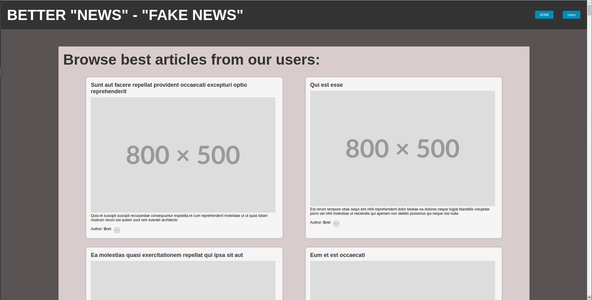
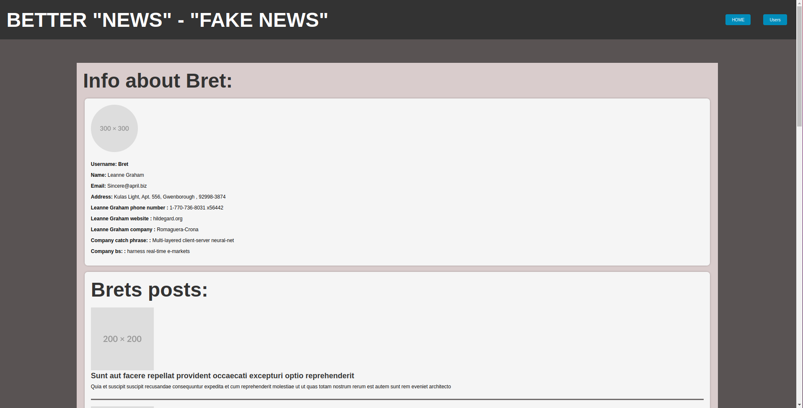
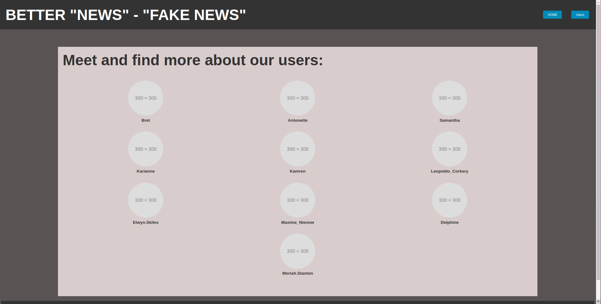

Hi, here are step by step instructions how to open my "article page" project:

| Step | Description                                      |
|------|--------------------------------------------------|
| 1    | Clone repo                                       |
| 2    | Install composer                                 |
| 3    | run php -S localhost:8000 from /public directory |

Webpage screenshots:

