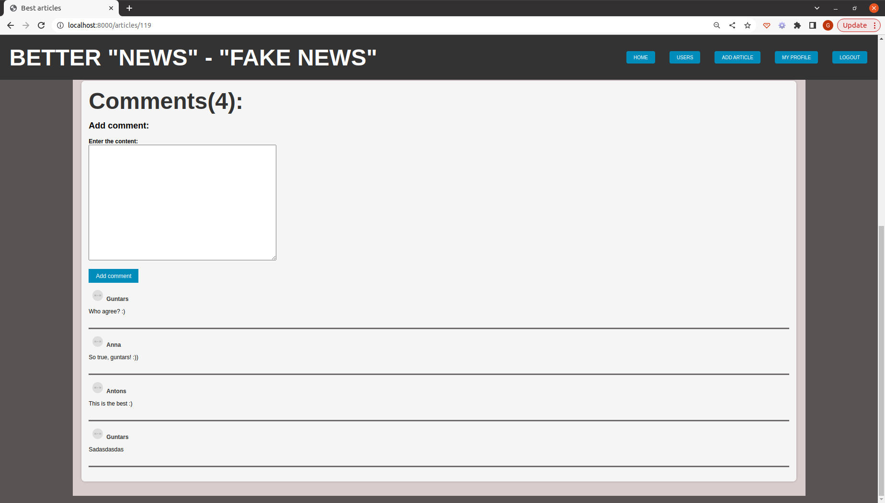

A dynamic article page built with PHP and follows the MVC (Model-View-Controller) pattern, ensuring a well-structured and maintainable codebase. It incorporates a robust routing system to handle different URL requests and leverages a cache system to enhance performance and optimize data retrieval. The website utilizes Twig as the template engine, and CSS for styling. 
Here are step by step instructions how to open my "article page" project:

| Step | Description                                                |
|------|------------------------------------------------------------|
| 1    | Clone repo                                                 |
| 2    | Install composer                                           |
| 3    | Rename .env.example and insert database connection details |
| 4    | Run php -S localhost:8000 from /public directory           |

Webpage screenshots:

